# My shop

"My shop" is a small e-commerce website that can help your productivity.

## table of contents

1. [About My Shop](#about-my-shop)
2. [Pages](#pages)
   - [index](#index)
   - [prdoucts](#prdoucts)
   - [details](#details)
   - [user dashboard](#dashboard)
   - [edit user profile](#edit-profile)
   - [orders](#orders)
   - [cart](#cart)
   - [others](#others)
4. [How to Run](#how-to-run)
5. [Frontend Template](#frontend-template)


## About My Shop

Welcome to the repository for my Django-based E-Commerce website! This project is a small yet powerful online store built with Django, a high-level Python web framework.

## Features

- **User-friendly Interface**: Intuitive design and seamless navigation for a delightful shopping experience.
- **Product Categories**: Browse through a diverse range of products with detailed descriptions.
- **User Authentication**: Secure user authentication and registration system.
- **Shopping Cart**: Add and manage your desired items with an easy-to-use shopping cart.
- **Order Processing**: Streamlined checkout process with order confirmation and tracking functionality.
- **Admin Dashboard**: Manage products, orders, and users effortlessly through the admin dashboard.


# pages

In this part you can know more about pages that built in this project and see screenshots of them too.

### index

The heart of your online store, the Index page is designed to captivate visitors and provide a seamless entry into the world of your products. Here's what makes the Index page special:

***Customizable Sliders and Banners***

Engage your audience from the first glance! The Index page features customizable sliders and banners, allowing you to showcase promotions, featured products, or any special events. Tailor your content to create a visually stunning introduction to your store.

***Latest Products with Discounts***

Stay ahead of the curve! The Index page dynamically displays the latest products, ensuring that visitors are always informed about your newest offerings. Highlight products with discounts to entice customers and drive sales.


***Screenshots***

in this part you can see some screenshots from index page.


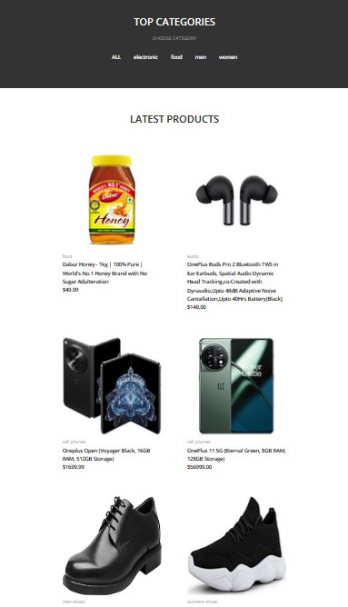

banner:


and this is another screenshot from a product in index page.

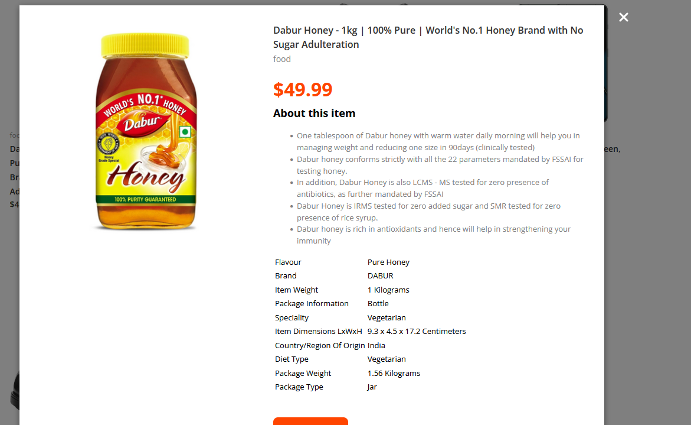


### prdoucts

The Products page, the heart of the online store where all offerings are showcased. Here's what makes the Products page unique:

***Diverse Selection of Products***

Explore a wide range of products across various categories and sub-categories. 

***Easy Navigation***

Navigate through the products with ease. You can switch between list and grid views to find what you're looking for. This user-friendly interface ensures a seamless shopping experience.


***Screenshots***

product grid: 

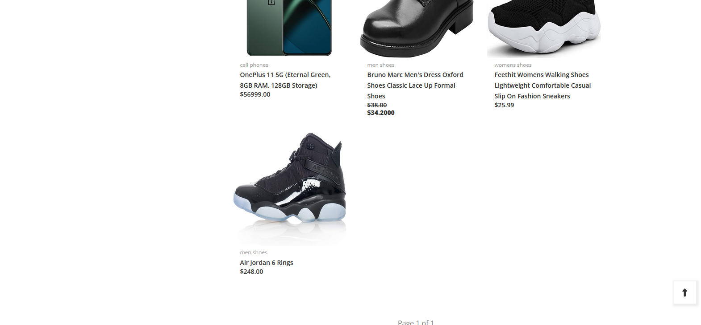

product list:

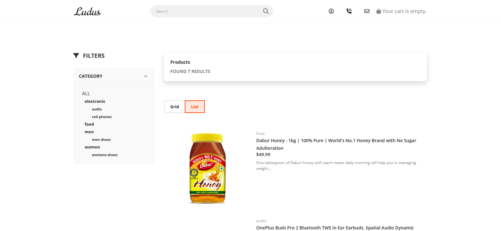


### details

in this we will have details of a product. also there is another section that contains 3 part.
1. explains about a product. you can add tables, videos and etc here.  
2. specifications. in this part we can know more about a product. 
3. comments. everybody can write their own comments about a product in this part. 

***Screenshots***

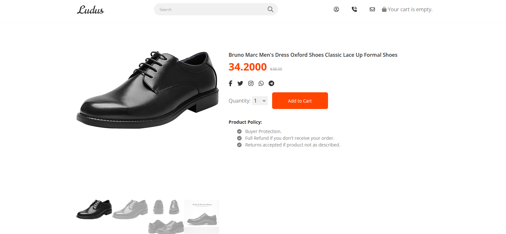

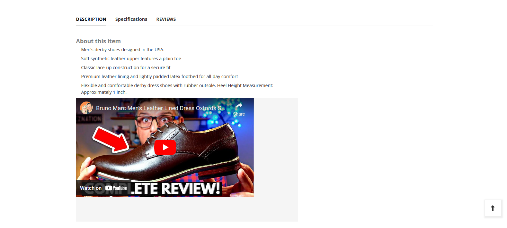


### Dashboard

user Dashboard contains 3 part. 
1. orders
2. edit profile
3. change password

***Screenshots***

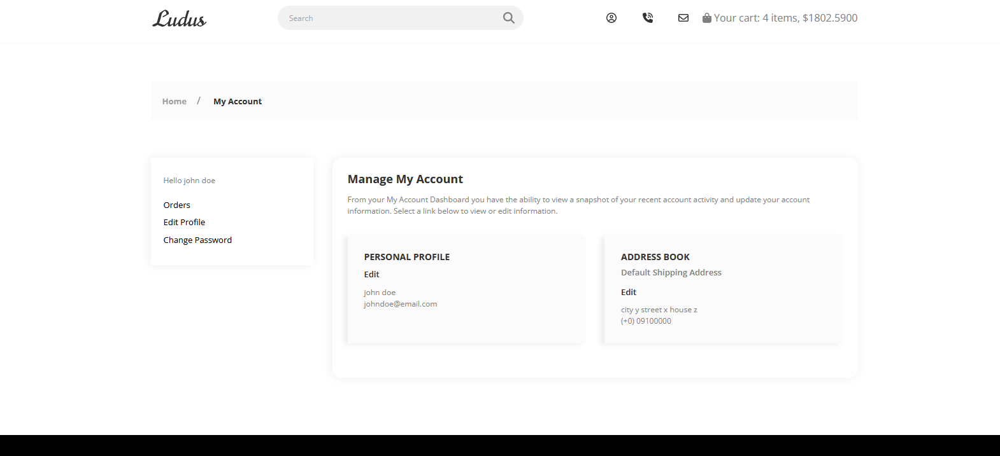


### edit profile

this is the edit profile form!

***Screenshots***

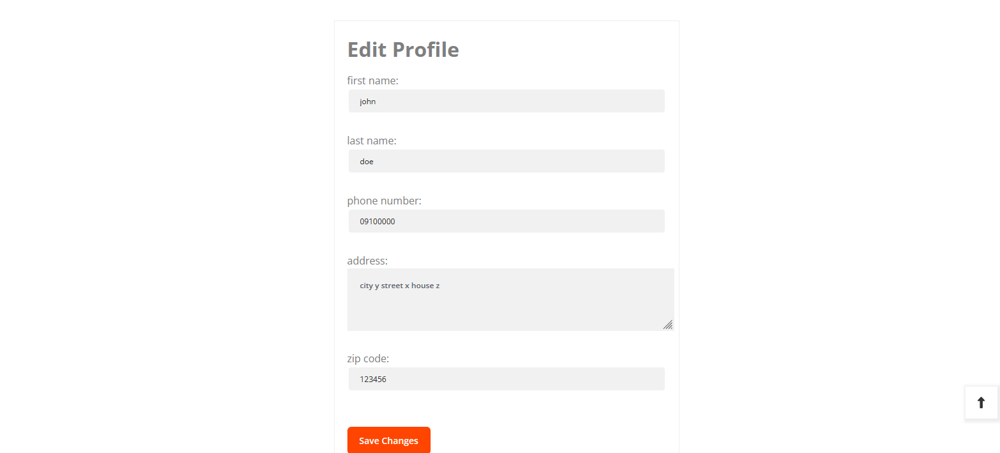


### Orders

users can see their orders in this part. orders will show as a list and users can see orders details with it!

***Screenshots***

orders list:

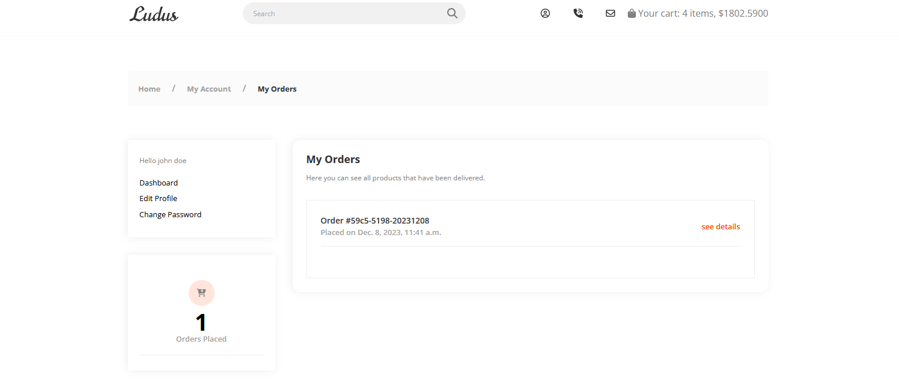

orders details:

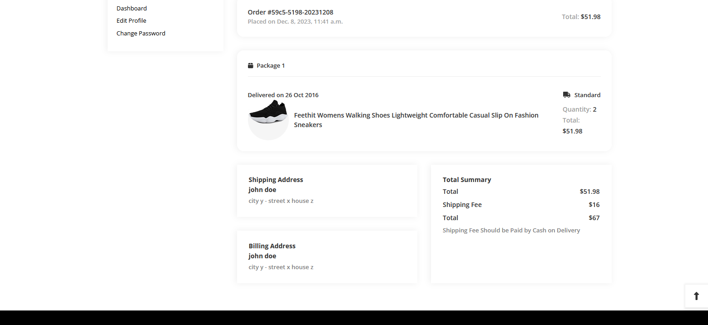


### Cart

this is the cart page. you can see your cart details with this page also you can have a discount with a coupon!

***Screenshots***

orders list:

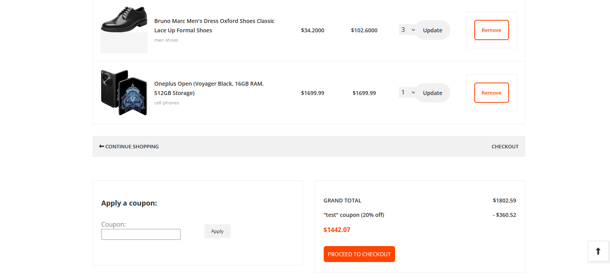


### Others

"My shop" contains other pages too. look like contact us, about us, sign up, log in, log out, change password and reset password(forget passord).

***sign up***

User should have an account so they can buy products. in this page, users can sign up. after they sign up they can enter the website but they should verify their accounts with an email that is sent to them.

***log in***

After user built their accounts they can use this page and sign in!

***Forget Password***

If users forget their password, they can reset their password with their emails.


***Change Password***

Also user can change their password through their dashboard if they need it.

***Contact Us***

All visitors of "My shop" can contact to admins through this page.

***About Us***

you can know more about "My shop" in this page.


PS: I should mention that I use [debugmail.io](https://debugmail.io/) to test email functionality!


## How to Run

To run this Django project, you'll need to have Docker installed on your machine. you can download Docker from  [here](https://www.docker.com/products/docker-desktop/).

Once you have Docker and Docker Compose installed, follow these steps:

Open a terminal window.

Navigate to the directory where the ```docker-compose.yml``` file is located.

Run the following command to build the Docker images and start the services:

```docker-compose up -d --build```

This command will build the Docker images (if they are not already present on your machine), create the necessary Docker containers, and start the services.

Before applying the Django migrations, you need to create new migrations based on the changes you have made to your models. You can do so by running the following command:

```docker-compose exec web python manage.py makemigrations```

This command will create new migrations based on the changes you have made to your models.

Once the migrations are created, you can apply them by running the following command:

```docker-compose exec web python manage.py migrate```

This command will apply the migrations to the Django application running in the web service.

Once the services are up and running, you can access the application by opening a web browser and navigating to 127.0.0.1:8000.


## Frontend Template

This project uses the [Ludus Free Premium Ecommerce Template](https://github.com/ahmadhuss/ludus-free-premium-ecommerce-template) as its frontend. The template was used as a base for the frontend development of this project.

